# 外卖程序组件说明
## pages
|名称|说明|options|组件|titleBarText||备注|
|-|-|-|-|-|-|-|
|home|主页、tabbar页面|scene|searchBar、navBottom、goodItem|首页|
|good-orderDetail|确认订单页面(未付款)|NaN|addressItem、orderItem、infoItem|确认订单|
|good-goodDetail|商品详情|NaN|addressItem、orderItem、infoItem|确认订单|
|order-orderDetail|订单详情页面(已付款)|NaN|addressItem、orderItem、infoItem|确认订单|
|order-orderList|订单列表、tabbar页面|NaN|orderItem|
|order-comment|订单评价页面|orderId|
|address-addressList||
|address-editAddress|addressInfo|
|user|我的页面、tabbar页面|
|user-myComment|我的评价|NaN|NaN|感谢评价|
|user-moneyDetail|余额明细|NaN|NaN|余额明细|
|user-coupon|优惠券|NaN|NaN|优惠券|
|user-qrcode|二维码|
|user-deposit|储值页面、tabbar页面|
|search|搜索页面|
|search-store|搜索店铺页面|


## components
|名称|说明|props|slot|绑定事件|备注|
|-|-|-|-|-|-|
|[addressItem](#一addressItem)|地址选项|addressInfo|NaN|onItemClick||
|[infoItem](#二infoItem)||info|NaN|onItemClick||
|[searchBar](#三searchBar)|搜索框|NaN|NaN|onSearch、onItemClick|
|[orderItem](#四orderItem)|订单里的Item|orderInfo|NaN|onItemCanCel、onItemClick、onItemPay、onItemRefund、onComment[、onAction]|
|[navBottom](#五navBottom)|底部导航栏|navInfo|NaN|onAction
|[navTitle](#六navTitle)|导航Title|navTitleInfo|NaN|onAction
|[starBox](#七starBox)|评价星级，评价内容储存在storage|starInfo|NaN|NaN
|[btn](#八btn)|按钮|type|NaN|onItemClick|
|[themeView](#九themeView)||type|有|无||
|[loading](#十loading)|加载中|NaN|NaN|NaN|
|[none](#十一none)|空空如也|NaN|NaN|NaN|
|[goodItem](#十二goodItem)|商品Item|goodInfo、type|NaN|onAction
|[commentItem](#十三commentItem)|评价Item|commentInfo|NaN|onAction|
|[couponItem](#十四couponItem)|优惠券Item|couponInfo||
|[orderDetailMap](#十五orderDetailMap)|订单上半部分带有地图部分、仅包含地图部分|
|[reduceAdd](#十六reduceAdd)|加减组件|number|NaN|onAction|
|[chooseBox](#十七chooseBox)|选择组件|chooseInfo|NaN|onAction|
|carBar|购物车bar|
## 组件详情
### 一、addressItem
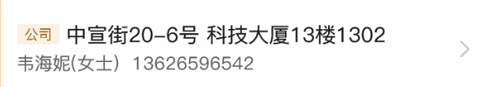
### 二、infoItem
#### props
```javaScript
{
    iconImg: '',
    title: '',
    iconArr: '',
    value: '',
    titleColor: '',
    valueColor: ''
}
```
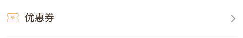
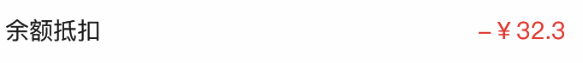
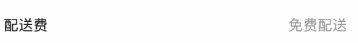
### 三、searchBar
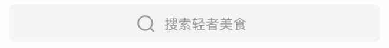
### 四、orderItem
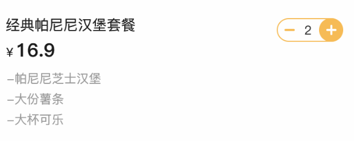
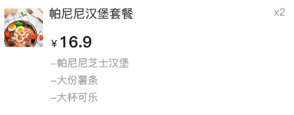
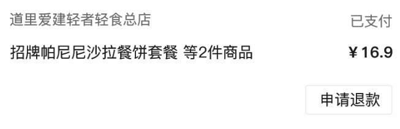
### 五、navBottom
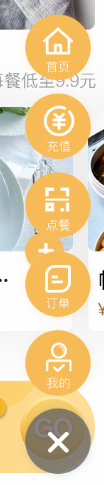
### 六、navTitle
#### props
```javaScript
navTitleInfo: {
    currentNavIndex: 0,
    navList: [{
        id: 0,
        title: '全部',
        selected: false
    },
    {
        id: 1,
        title: '自取',
        selected: false
    },
    {
        id: 2,
        title: '外卖',
        selected: false
    },
    {
        id: 3,
        title: '店内点餐',
        selected: false
    }
    ]
}
```
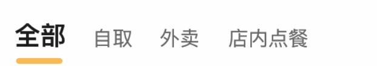
### 七、starBox
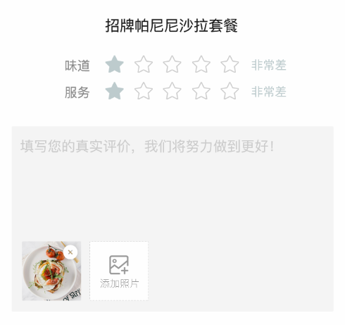
### 八、btn

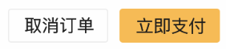
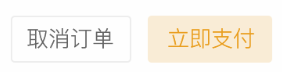
### 九、themeView
### 十、loading
### 十一、none
### 十二、goodItem
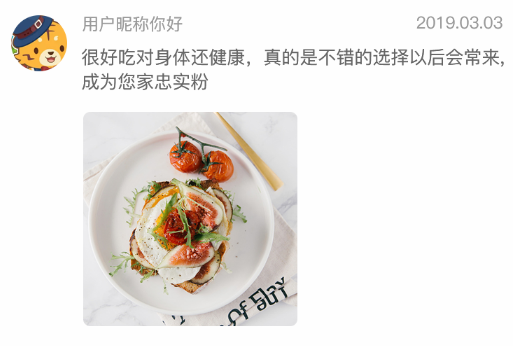

### 十三、commentItem


### 十四、couponItem
